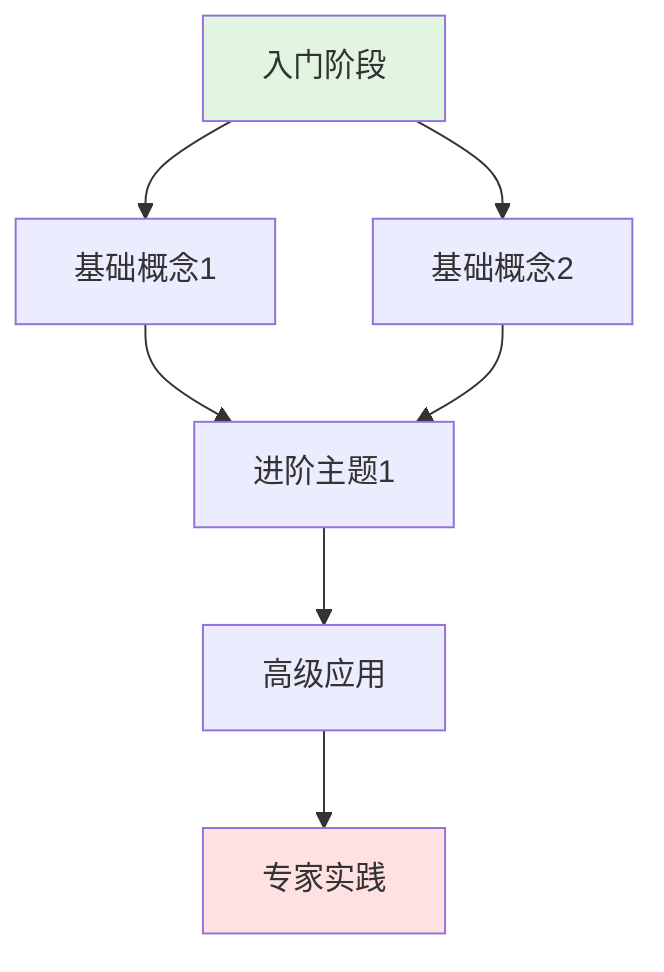

# 🗺️ MOC - {{title}}

> **Map of Content** - 这是一张关于 [主题] 的知识地图，帮助你系统化地理解和导航相关内容。

## 📖 地图概览

**这张地图包含什么？**


**适合谁？**


**如何使用这张地图？**


## 🌱 核心概念

### 基础概念

- [[]] - [一句话描述]
- [[]] - [一句话描述]
- [[]] - [一句话描述]

### 进阶概念

- [[]] - [一句话描述]
- [[]] - [一句话描述]
- [[]] - [一句话描述]

## 🛠️ 实践方法

### 方法论

- [[]] - [适用场景]
- [[]] - [适用场景]
- [[]] - [适用场景]

### 工具与技巧

- [[]] - [工具说明]
- [[]] - [工具说明]
- [[]] - [工具说明]

## 📚 推荐资源

### 必读书籍

1. **[书名]** - [[阅读笔记]]
   - 作者:
   - 推荐理由:

2. **[书名]** - [[阅读笔记]]
   - 作者:
   - 推荐理由:

### 优质课程

- **[课程名]** - [[课程笔记]]
  - 平台:
  - 推荐理由:

### 精选文章

- [[]] - [主要观点]
- [[]] - [主要观点]

## 🔗 相关地图

### 上游地图（更宏观的主题）

- [[MOC - ]]

### 下游地图（更细分的主题）

- [[MOC - ]]
- [[MOC - ]]

### 相关地图（同层级的主题）

- [[MOC - ]]
- [[MOC - ]]

## 🎯 学习路径



### 阶段1: 入门（1-2周）

**学习目标**:

**推荐资源**:
-

**关键笔记**:
- [[]]

### 阶段2: 进阶（3-4周）

**学习目标**:

**推荐资源**:
-

**关键笔记**:
- [[]]

### 阶段3: 精通（持续）

**学习目标**:

**推荐资源**:
-

**关键笔记**:
- [[]]

## 📊 知识结构

### 理论框架


### 实践案例


### 常见问题


## 💡 个人见解

### 我的理解


### 实践经验


### 待探索的方向


## 📝 相关项目

```dataview
TABLE status, priority
FROM "02-项目"
WHERE contains(tags, "{{title}}")
SORT status ASC
```

## 🔄 更新日志

### {{date:YYYY-MM-DD}}
- 创建此地图

### [日期]
- [更新内容]

---

**创建时间**: {{date:YYYY-MM-DD}}
**最后更新**: {{date:YYYY-MM-DD}}
**完善度**: 🌱 萌芽 / 🌿 成长 / 🌳 成熟
**相关笔记数**: [X] 篇
