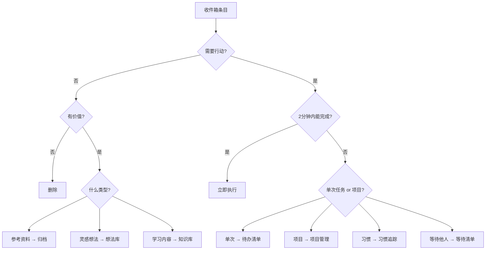

# 收件箱清理流程

## 核心目标

收件箱清理的目的是将**未处理的原始输入**转化为**可执行的行动**或**有价值的知识资产**，让收件箱保持清空状态。

> [!important] Inbox Zero理念
> "零收件箱"不是强迫症，而是确保每个信息都被妥善处理，不会遗漏重要事项。

## 为什么要清理收件箱

### 不清理的问题

- 📦 信息堆积，重要事项被淹没
- 🧠 心理负担，总觉得有事没做
- ⏱️ 寻找信息浪费时间
- 🔁 重复查看同样内容，效率低下
- 💔 失去对系统的信任，回到"凭记忆工作"

### 清理的好处

- ✅ 头脑清晰，知道下一步做什么
- ✅ 不遗漏重要信息和任务
- ✅ 提高执行效率
- ✅ 建立对系统的信任

## 清理频率

| 收件箱类型 | 推荐频率 | 说明 |
|-----------|---------|------|
| **邮件收件箱** | 每天2-3次 | 早上、午休后、下班前 |
| **笔记收件箱** | 每天1次 | 晚上或早上固定时间 |
| **待办收件箱** | 每天1次 | 结合日计划 |
| **阅读清单** | 每周1次 | 周末回顾时 |
| **临时文件夹** | 每周1次 | 避免文件堆积 |

> [!tip] 最佳实践
> 选择一个固定时间清理，形成习惯。例如每天早上9点或晚上9点。

## 清理的五个步骤

### 步骤1：收集（Collect）

确保所有待处理内容都在收件箱中。

```markdown
检查清单：
- [ ] 桌面上的便签纸
- [ ] 手机备忘录
- [ ] 聊天软件的收藏
- [ ] 浏览器的标签页
- [ ] 纸质笔记本
- [ ] 待读文章列表
```

### 步骤2：明确意义（Clarify）

对每一条内容，问自己：

1. **这是什么？** 理解内容本质
2. **可以采取行动吗？** 判断是否需要行动
3. **下一步行动是什么？** 具体的第一步

### 步骤3：组织（Organize）

根据内容性质进行分类处理。



### 步骤4：回顾（Review）

处理过程中定期暂停，确保：
- 分类是否合理
- 优先级是否正确
- 是否有遗漏

### 步骤5：执行（Engage）

清理完成后，从整理好的任务列表中选择执行。

## 处理决策树

### 决策点1：是否需要行动？

#### ❌ 不需要行动

| 情况 | 处理方式 | 示例 |
|------|---------|------|
| **垃圾信息** | 直接删除 | 无关广告、过时信息 |
| **参考资料** | 归档到知识库 | 文档、教程、指南 |
| **孵化想法** | 放入Someday/Maybe | "有空学习摄影" |

#### ✅ 需要行动

继续判断 → 决策点2

### 决策点2：需要多少时间？

#### ⚡ 2分钟内可完成

**立即执行！** 不要推迟。

示例：
- 回复简单邮件
- 下载文件
- 记录到日历
- 转发信息

#### ⏱️ 超过2分钟

继续判断 → 决策点3

### 决策点3：是否需要他人？

#### 🤝 需要等待他人

放入"等待清单"，设置提醒。

```markdown
**等待清单格式**
- 等待XX回复关于YY的邮件（2024-01-20前）
- 等待产品确认需求文档（本周五前）
```

#### 👤 自己可以完成

继续判断 → 决策点4

### 决策点4：单次任务还是项目？

#### 📝 单次任务

加入待办清单，标注：
- 优先级
- 截止时间
- 所属项目/领域

示例：
```markdown
- [ ] 完成用户登录功能的单元测试 #高优先级 @2024-01-25 [[用户系统项目]]
```

#### 📁 多步骤项目

创建项目页面，分解为具体任务。

```markdown
# 项目：用户系统重构

**目标**：提升系统性能和可维护性

**任务分解**
- [ ] 梳理现有系统架构
- [ ] 设计新的数据模型
- [ ] 编写迁移脚本
- [ ] 完成核心功能开发
- [ ] 编写测试用例
- [ ] 上线部署

**下一步行动**：约技术讨论会议
```

## 不同类型内容的处理

### 1. 快速笔记/想法

```markdown
**处理方式**
- 重新阅读，判断是否仍有价值
- 如果是待办 → 加入任务列表
- 如果是想法 → 扩展为完整笔记或放入想法库
- 如果是临时信息 → 删除
- 如果是知识 → 链接到相关主题笔记
```

**示例**：
- 原始："研究GraphQL"
- 处理后：
  - → 创建 `[[GraphQL学习计划]]`
  - → 添加任务"看完GraphQL官方文档"
  - → 链接到 `[[后端技术栈]]`

### 2. 阅读材料

```markdown
**处理流程**
- 快速浏览，判断是否仍想读
- 不想读 → 删除（不要有罪恶感）
- 想读 → 评估优先级
  - 高优先级 → 安排时间阅读
  - 中优先级 → 保留在阅读列表
  - 低优先级 → 考虑删除
```

> [!warning] 阅读清单陷阱
> 只收藏不阅读会造成焦虑。定期清理，对不会读的文章说"不"。

### 3. 会议记录

```markdown
**处理要点**
- 提取行动项 → 加入任务列表
- 重要决策 → 整理为决策记录
- 有价值讨论 → 扩展为知识笔记
- 会议记录本身 → 归档到项目或日期文件夹
```

### 4. 代码片段/技术笔记

```markdown
**处理方式**
- 立即需要 → 应用到项目中
- 未来可能用 → 整理为代码库/模板
- 学习记录 → 扩展为完整技术笔记
- 已过时 → 删除
```

### 5. 项目相关材料

```markdown
**处理方式**
- 关联到对应项目页面
- 如果是新项目 → 创建项目文件夹
- 更新项目进度和下一步行动
```

## 实际操作流程

### 我的每日收件箱清理流程

**时间**：每天早上9:00或晚上21:00
**时长**：15-30分钟

```markdown
1. 【打开收件箱】进入 `01-收件箱/快速笔记`

2. 【从上到下处理】每一条笔记
   - 阅读并理解内容
   - 应用决策树判断
   - 执行对应操作
   - ✅ 处理完成后立即删除或移走

3. 【批量操作】
   - 待办事项 → 统一添加到任务管理系统
   - 知识笔记 → 移动到对应主题文件夹
   - 项目材料 → 归档到项目目录

4. 【最终检查】
   - 收件箱是否清空？
   - 重要任务是否都已记录？
   - 今日待办是否明确？

5. 【完成】收件箱为空，头脑清晰 ✨
```

### 每周深度清理

**时间**：每周日晚上
**时长**：30-60分钟

```markdown
1. 【清理收件箱】按日常流程处理

2. 【回顾任务列表】
   - 删除已完成任务
   - 调整优先级
   - 识别过期任务

3. 【清理项目】
   - 更新项目状态
   - 归档完成的项目
   - 计划下周重点

4. 【清理文件夹】
   - 临时文件夹
   - 下载文件夹
   - 桌面文件

5. 【回顾学习】
   - 未读文章处理
   - 学习笔记整理
   - 知识库维护
```

## 提高清理效率的技巧

### 1. 快捷键和批量操作

```markdown
**Obsidian快捷键**
- Ctrl/Cmd + N：新建笔记
- Ctrl/Cmd + E：切换编辑/预览
- Ctrl/Cmd + O：快速打开
- Ctrl/Cmd + Delete：删除文件

**批量操作**
- 相同类型的内容一起处理
- 使用标签筛选
- 文件拖拽移动
```

### 2. 模板和标准化

为常见类型建立处理模板，减少思考时间。

```markdown
**任务模板**
- [ ] [任务名] #[优先级] @[日期] [[关联项目]]

**项目模板**
见 → [[项目管理模板]]

**笔记模板**
见 → [[卡片盒笔记模板]]
```

### 3. 设定时间限制

- ⏱️ 每条内容不超过30秒决策
- ⏱️ 整个清理过程不超过30分钟
- ⏱️ 如果超时，分批处理

### 4. 降低完美主义

- ✅ 及格即可，不必完美分类
- ✅ 快速决策，相信直觉
- ✅ 有疑问时选择最简单的处理方式

## 常见问题

### Q: 收件箱总是清不完？

**原因分析**：
- 可能捕获过度，什么都往收件箱放
- 清理频率不够，堆积太多
- 处理犹豫不决，每条都要深思

**解决方案**：
- 提高捕获标准，只记录重要内容
- 增加清理频率，每天清理
- 使用"2分钟决策法"，快速处理

### Q: 不知道如何分类？

**解决方案**：
- 建立简单清晰的分类体系（不超过7个主要分类）
- 有疑问时默认放入"杂项"
- 定期回顾分类体系，调整优化

### Q: 清理后又堆积？

**解决方案**：
- 形成固定习惯，每天同一时间清理
- 使用提醒/闹钟
- 将清理纳入日常流程（如每日回顾）

### Q: 总有些内容不知道怎么处理？

**解决方案**：
- 创建"待决策"文件夹，暂存难以决策的内容
- 每周回顾时集中处理
- 超过2周未处理的，直接删除

## 清理检查清单

```markdown
- [ ] 所有收件箱条目都已处理
- [ ] 待办事项已加入任务系统
- [ ] 有价值笔记已归档到知识库
- [ ] 项目材料已关联到对应项目
- [ ] 无用信息已删除
- [ ] 收件箱文件夹为空
- [ ] 今日/本周任务明确
- [ ] 感觉头脑清晰、轻松
```

## 相关资源

- [[快速捕获技巧]]
- [[任务管理系统]]
- [[项目管理方法]]
- [[GTD工作流]]
- [[知识管理体系]]

## 延伸思考

- 如何在信息过载时代保持收件箱可控？
- 清理收件箱与专注工作如何平衡？
- 数字极简主义对收件箱管理有什么启示？

---

*最后更新：2024-01-15*
